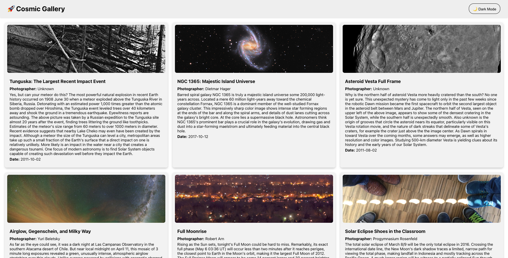
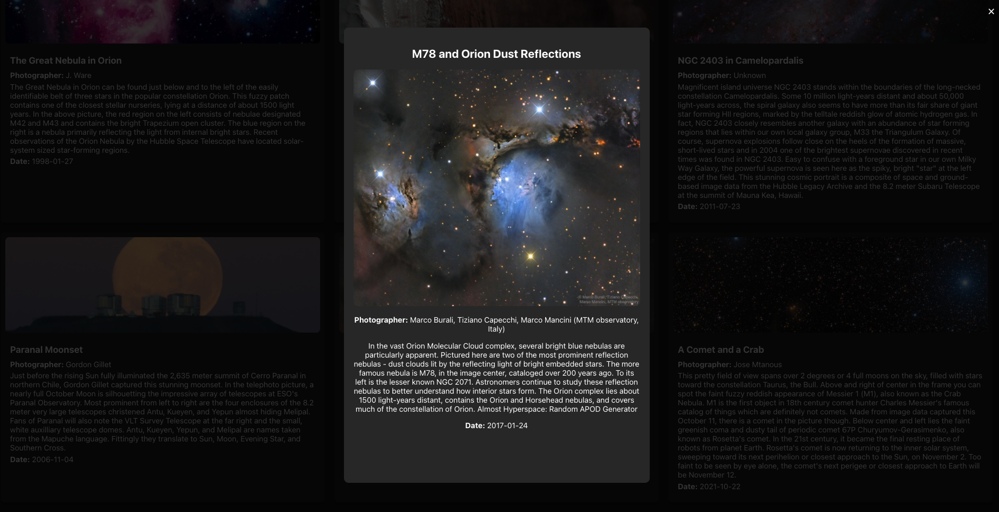
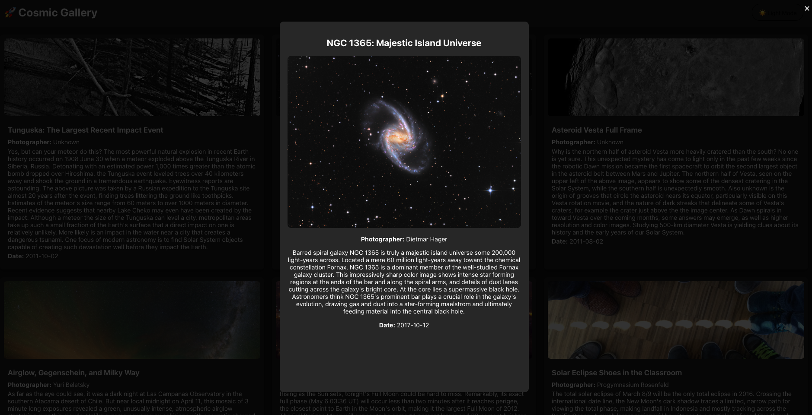

# 🌌 NASA React Gallery

**NASA React Gallery** is a clean and minimal React app that fetches and displays images from NASA's [Astronomy Picture of the Day (APOD)](https://api.nasa.gov/) API. Each image is accompanied by its title, date, and explanation — giving users a daily dose of cosmic wonder.

> ✨ Powered by NASA's public API and built with React.

---

## ✨ Features

- 🔭 Fetches the Astronomy Picture of the Day from NASA
- 🖼️ Displays image, title, date, and detailed explanation
- 🔄 Refreshes content with a new random date
- ⚛️ Built with modern React (hooks, functional components)
- 🚀 Deployed via GitHub Pages

---

## 🌐 Live Demo

See it in action:  
👉 [https://josgard94.github.io/nasa-react-gallery](https://josgard94.github.io/nasa-react-gallery)

---

## 🎨 UI Design

Take a look at the clean and responsive user interface built with React:

<p align="center">
  
  <br/><br/>
  
  <br/><br/>
  
</p>

---


## 🛠️ Tech Stack

- **Frontend**: React (JavaScript, JSX)
- **API**: [NASA APOD API](https://api.nasa.gov/)
- **Styling**: CSS (Flexbox)
- **Deployment**: GitHub Pages (`gh-pages`)

---

## 📦 Installation

1. Clone the repository:

```bash
git clone https://github.com/josgard94/nasa-react-gallery.git
cd nasa-react-gallery/client
```
2. Install dependencies:

```bash
npm install
```
3. Create a .env file and add your NASA API Key:

```bash
REACT_APP_ROOT_API="https://api.nasa.gov/planetary/apod?api_key=YOUR_API_KEY_HERE&count=6"
```
4. Run the app:
```bash 
npm run start
```
## 🚀 Deployment
To deploy on GitHub Pages:

```bash
    npm run deploy
```
This will build the app and push it to the gh-pages branch for live hosting.

## ⭐ Like it?
Leave a ⭐ if you enjoy it or find it useful!