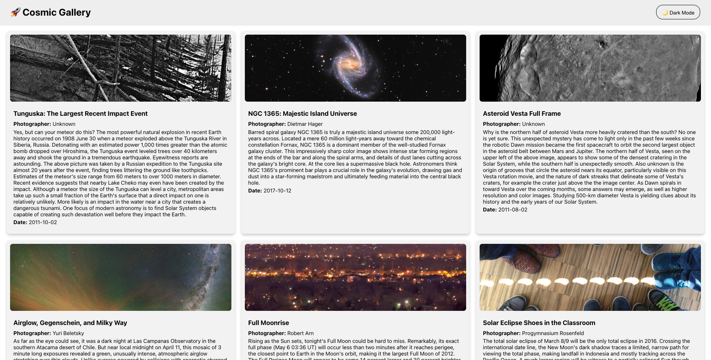
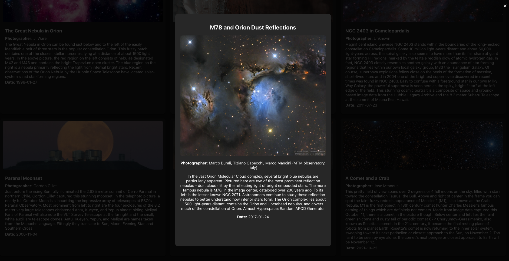
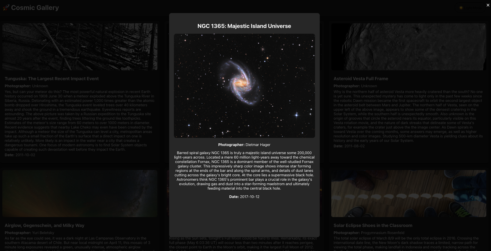

# NASA React Gallery

**NASA React Gallery** is a React app that fetches images from NASA’s [Astronomy Picture of the Day (APOD)](https://api.nasa.gov/) API and shows near–real-time space weather alerts from public NOAA/SWPC data. It includes a responsive gallery, persistent favorites, and a light/dark theme.

> Powered by NASA’s public API and built with React.

---

## Features

### Gallery (APOD)

- Fetches multiple images per request (e.g. `count=8`) and displays them in a responsive grid.
- **Refresh** in the header re-fetches from the API (new random set depending on your configured URL).
- **Progressive loading**: reveals cards in batches of eight as you scroll (Intersection Observer).
- **Skeleton loaders** for the initial load and a refreshing state on reloads.
- **Lazy-loaded card media**: images load when the card enters the viewport.
- **Video** entries supported via `thumbnail_url` when `media_type` is video.
- Click a card to open a **modal** with title, date, explanation, and favorite toggle.
- Clear errors if the API URL is missing, the response is not valid JSON, or NASA returns an API error object.

### Favorites

- Favorite images from the grid or the modal.
- Favorites persist in **localStorage** (`nasa-gallery-favorites`) as snapshots of the fields needed to render cards and the modal without an extra fetch.
- **Favorites** tab with a badge count when there are saved items.

### Space weather

- Alert list from SWPC’s public JSON (default: [alerts.json](https://services.swpc.noaa.gov/products/alerts.json)).
- **Pagination / load more** via scrolling inside the alerts panel.
- Event-type classification, severity badges (G/R/S scales when applicable), and loading skeletons.
- Optional env: `REACT_APP_SWPC_ALERTS_URL` to point at another compatible alerts URL.

### UI and accessibility

- **Light / dark theme** persisted in `localStorage` (defaults to dark).
- **Tab** navigation (Gallery, Favorites, Space weather) with ARIA roles (`tab`, `tabpanel`).

---

## Live demo

[https://josgard94.github.io/nasa-react-gallery](https://josgard94.github.io/nasa-react-gallery)

---

## UI

<p align="center">
  
  <br/><br/>
  
  <br/><br/>
  
</p>

---

## Tech stack

- **Frontend**: React 18 (hooks, function components), Create React App
- **Data**: [NASA APOD API](https://api.nasa.gov/), [NOAA SWPC JSON](https://services.swpc.noaa.gov/json/) (alerts)
- **Styling**: Global CSS, CSS Modules for gallery components
- **Deployment**: GitHub Pages (`gh-pages`)

---

## Installation

1. Clone the repository and go to the client folder:

```bash
git clone https://github.com/josgard94/nasa-react-gallery.git
cd nasa-react-gallery/client
```

2. Install dependencies:

```bash
npm install
```

3. Create a `.env` file in `client/` with your APOD URL (get a free key at [api.nasa.gov](https://api.nasa.gov/)):

```bash
REACT_APP_ROOT_API="https://api.nasa.gov/planetary/apod?api_key=YOUR_API_KEY&count=8"
```

Optional — alternate SWPC alerts source:

```bash
REACT_APP_SWPC_ALERTS_URL="https://services.swpc.noaa.gov/products/alerts.json"
```

4. Run the app:

```bash
npm start
```

---

## Deployment (GitHub Pages)

From `client/`:

```bash
npm run deploy
```

Builds the app and pushes to the `gh-pages` branch for GitHub Pages hosting.

---

NASA and NOAA/SWPC data are subject to their respective terms of use. Leave a star if you find this project useful.
